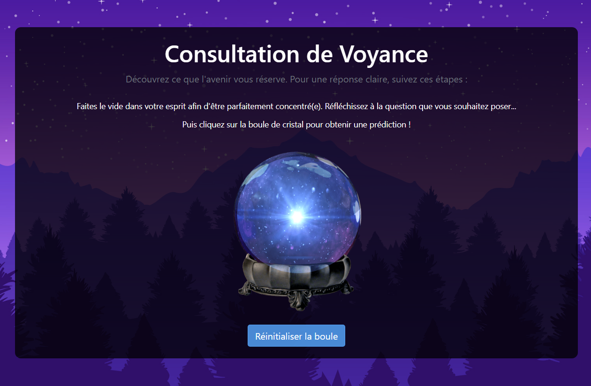

# Application de Voyance 🔮

Une application de voyance où vous pouvez obtenir des prédictions aléatoires en cliquant sur une boule de cristal.

Vous avez toujours voulu connaître votre avenir ? N'hésitez plus et demandez à notre boule de cristal. Bon, je ne vous garantie pas la fiabilité des prédictions, mais si elles s'avèrent justes, je me reconvertie en voyante professionnelle !

## Fonctionnalités

- **Prédictions Aléatoires**: Obtenez des prédictions en cliquant sur la boule de cristal.
- **Facile à Utiliser**: Interface simple et conviviale pour une expérience utilisateur agréable.

## Comment Utiliser

1. Clonez ce dépôt sur votre machine locale.
2. Ouvrez `index.html` dans votre navigateur web préféré.
3. Cliquez sur la boule de cristal pour connaître votre avenir 😌.

## Technologies Utilisées

- HTML
- CSS
- JavaScript

## Capture d'écran

